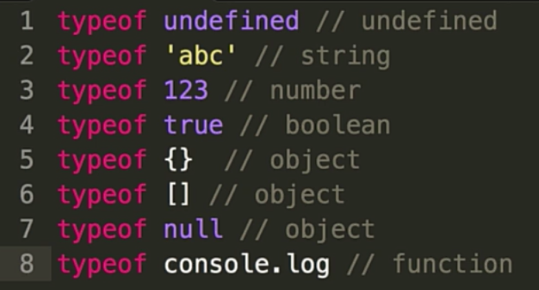
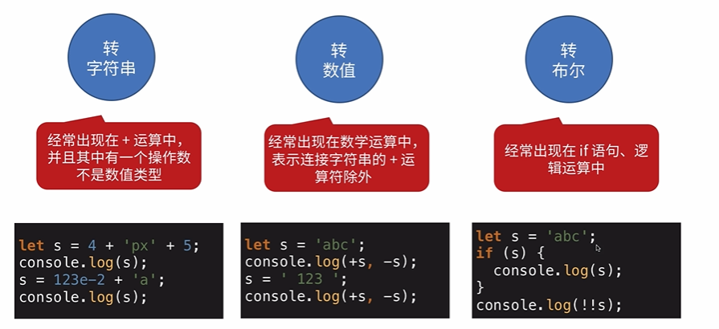
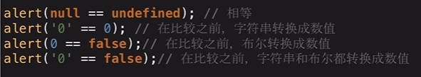
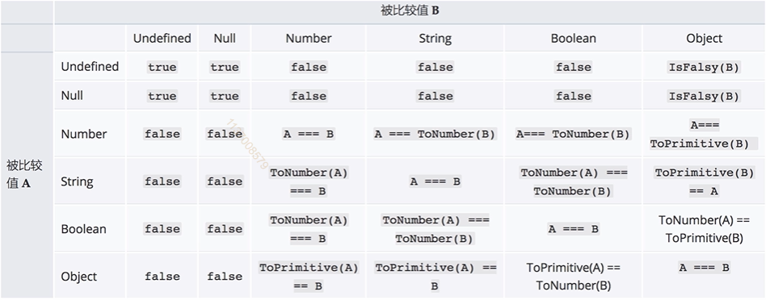
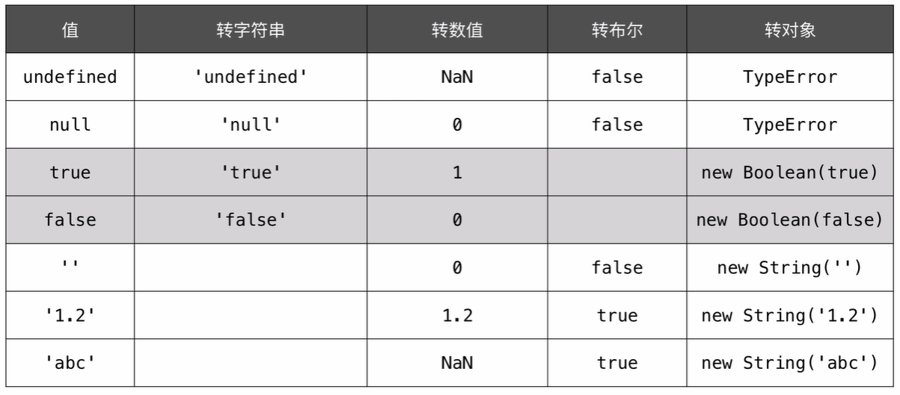
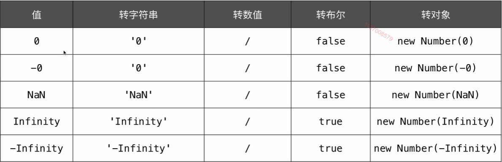
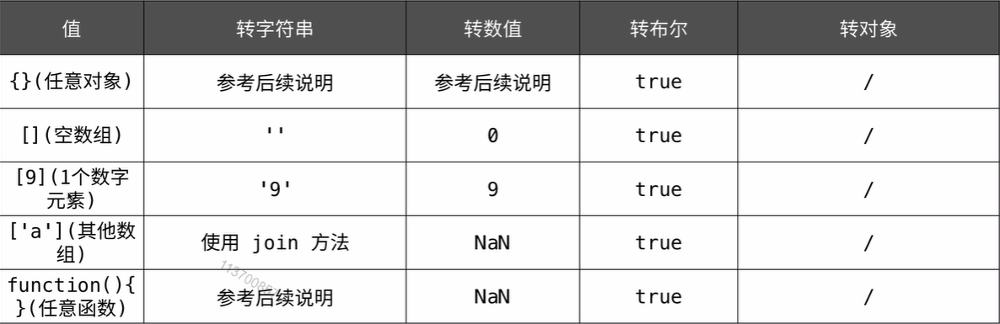
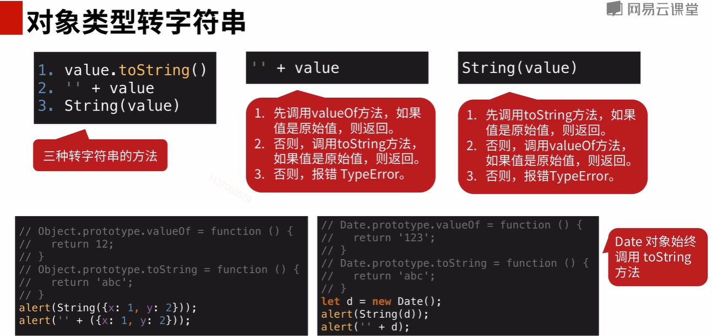
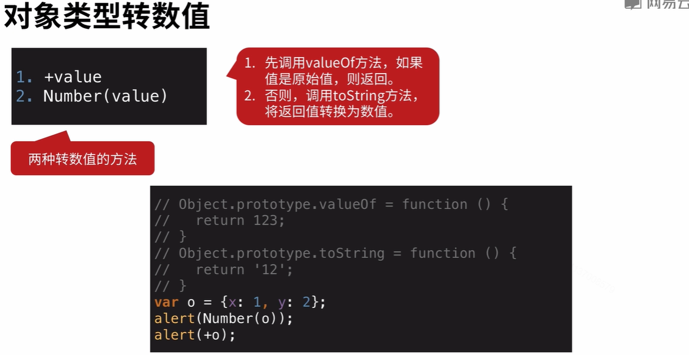

# JS变量复习

- typeof 能得到哪些类型
- === 和 ==
- JS的内置函数
- 按存储方式划分，js变量有哪些类型
- 理解JSON

## 变量类型

### 值类型和引用类型

值类型：undefined, number, boolean, string, symbol, null

引用类型：function, object

还牵扯到堆内存和栈内存的关系，稍微延伸一下。

#### 堆内存和栈内存

**栈内存**主要用于存储各种**基本类型的**变量，包括boolean、number、string、undefined、null，以及对象变量的指针，这时候栈内存给人的感觉就像一个线性排列的空间，每个小单元大小基本相等。

而堆内存主要负责像对象Object这种变量类型的存储，如下图

原始数据类型都有固定的大小保存在栈内存中，由系统自动分配存储空间，可以直接进行操作。

对于new出来的变量，思考一下new关键字所作所为，就知道，new出来的对象都是存储在堆内存中的。

我们常说的值类型和引用类型其实说的就是栈内存变量和堆内存变量，再想想值传递和引用传递、深拷贝和浅拷贝，都是围绕堆栈内存展开的，一个是处理值，一个是处理指针。

#### 变量定义的过程

例如`var a = 10`:

先将`10`压入栈中，然后在当前作用域中声明一个变量`a`，此时`a = undefined`，然后再将 `a` **关联**到`10`。

#### 函数定义的过程

现在堆内存中开辟一块空间，将函数的以字符串的形式存入。然后会有一个十六进制的堆内存的值。然后存入栈内存中。然后声明变量fn，然后将fn关联到这个内存地址上。

#### 垃圾回收机制

##### 浏览器的垃圾回收机制

- 引用计数（RC）

- 标记清除

  标记清除指的是当变量进入环境时，这个变量标记为“进入环境”;而当变量离开环境时，则将其标记为“离开环境”，最后，垃圾回收器完成内存清除工作，销毁并回收那些被标记为“离开环境”的值所占用的内存空间

##### V8的垃圾回收机制

分代回收：新生代和老生代。

###### 新生代的垃圾回收

在堆内存中分两个部分，一个 From（使用中的空间） ，一个
To（闲置状态），分配对象的时候先在from空间中进行分配，如果一个对象不再被引用了，那么将会被留在From中，将其他被引用的对象移动到To空间中，然后对调From和To，最后释放To中的空间。

###### 晋升

在新生代垃圾回收的过程中，当一个对象经过多次复制后依然存活，他将会被认为是生命周期较长的对象，随后会被移动到老生代中，采用新的算法进行管理

在From空间和To空间进行反转的过程中，如果To空间中的使用量已经超过了25%,那么就将From中的对象直接晋升到老生代内存空间中

###### 老生代的垃圾回收

老生代的内存空间是一个连续的结构。

标记清除（Mark Sweep）：标记要回收的对象，直接释放相应的地址空间。执行完成之后会导致内存不连续 。

标记合并（Mark Compact）：将存活的对象移动到一边，需要被回收的移动到另一边。然后对需要被回收的区域进行整体垃圾回收。

### typeof

## 变量计算

### 强制类型转换的场景

- 字符串拼接
- == 运算符
- if语句
- 逻辑运算

#### 双等号的比较的时候的类型转换

