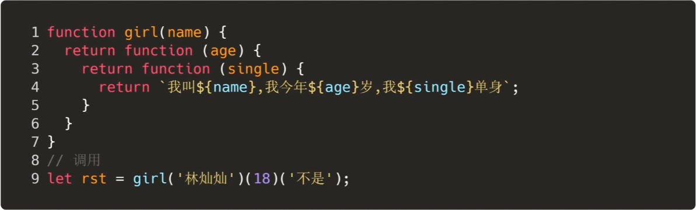
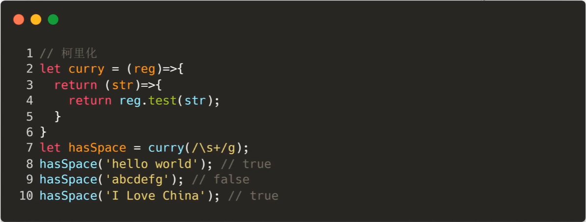
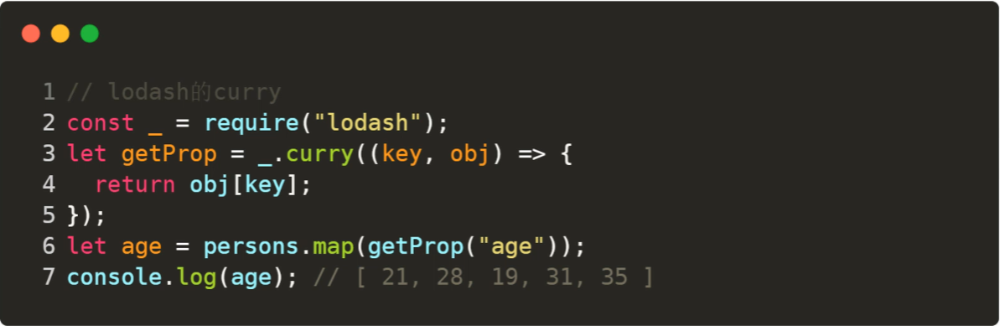

# 函数相关

## compose函数和pipe函数

函数组合，将多个函数组合在一起。

### compose函数

- 将需要嵌套执行的函数平铺
- 嵌套执行指的是，一个函数的返回值作为另一个函数的参数

`compose` 函数主要是实现了函数式编程中的 `pointfree` ，使我们专注于转换而不是数据本身。

也就是说，我们可以把数据处理的过程，定义成一种与参数无关合成运算。不需要关注参数本身，只需要将运算合成即可。

`pointfree` 就是不使用所要处理的值，只合成运算过程。即无参数分隔。

```js
let compose = function () {
  // 将arguments转为数组
  let args = [].slice.call(arguments)
  return function (params) {
    // 自右向左，依次执行
    return args.reduceRight(function (res, cb) {
      return cb(res)
    }, params)
  }
}
```

es6版：

```js
const compost = (...args) => params => args.reduceRight((res, cb) => cb(res), params)
```

Redux就是依赖compose来实现中间件的功能的。

Webpack的loader也是。

### pipe函数

pipe就是compose的复制版，只不过执行方向变了，改为从左向右

```js
export default function Pipe(...funcs) {
  return params => funcs.reduce((res, cb) => cb(res), params)
}
```

## 常用函数

### memozition

将上次的计算结果缓存起来，当下次调用时，如果遇到了相同的参数，就直接返回缓存中的数据

原理：

将参数和对应结果存储到一个对象中，调用时，先判断参数对应的数据是否存在，如果存在则直接返回，如果不存在才计算并存到缓存中。

闭包的灵魂体现！

lodash中的memoize实现：

```js
// func是需要缓存的函数，resolver是计算key的函数
function memoize(func, resolver) {
  // 类型校验
  if (typeof func !== 'function' || (resolver != null && typeof resolver !== 'function')) {
    throw new TypeError('Expected a function')
  }
  const memoized = function(...args) {
    // 先计算一下key，如果没有计算函数，则取第一个参数
    const key = resolver ? resolver.apply(this, args) : args[0]
    
    // 取缓存
    const cache = memoized.cache

    // 如果缓存中有值，则直接返回
    if (cache.has(key)) {
      return cache.get(key)
    }
    // 缓存中没有值，先计算，再放入缓存中，再更新缓存
    const result = func.apply(this, args)
    memoized.cache = cache.set(key, result) || cache
    return result
  }
  // 缓存初始化为Map
  memoized.cache = new (memoize.Cache || Map)
  // 返回缓存函数
  return memoized
}

memoize.Cache = Map

export default memoize
```

使用场景：

需要大量重复计算或依赖之前的结果的情况

比如斐波那契数列

### curry

将使用多个参数的一个函数，转化成一系列使用一个参数的函数的技术。



比如，使用正则校验一个字符串：



或者从对象数组中取某一个字符的值



在调用 `getProp("age")` 之后，这个的返回值，就变成了接受一个对象并返回对象的 `age` 属性的函数，放在map中就很舒服了。

### 偏函数

如果说，柯里化是将一个多参数函数转换成多个单参数函数，也就是将一个n元函数转换成n个一元函数。

那么偏函数就是固定一个函数的一个或者多个参数，也就是将一个n元函数转换成一个n-x元函数。

也就是：

```js
柯里化： f(a,b,c) => f(a)(b)(c)
偏函数： f(a,b,c) => f(a,b)(c)
```

可以简单实用bind来实现

```js
let add = (x, y) => x + y;
let rst = add.bind(null, 1);
rst(2); // 3
```
