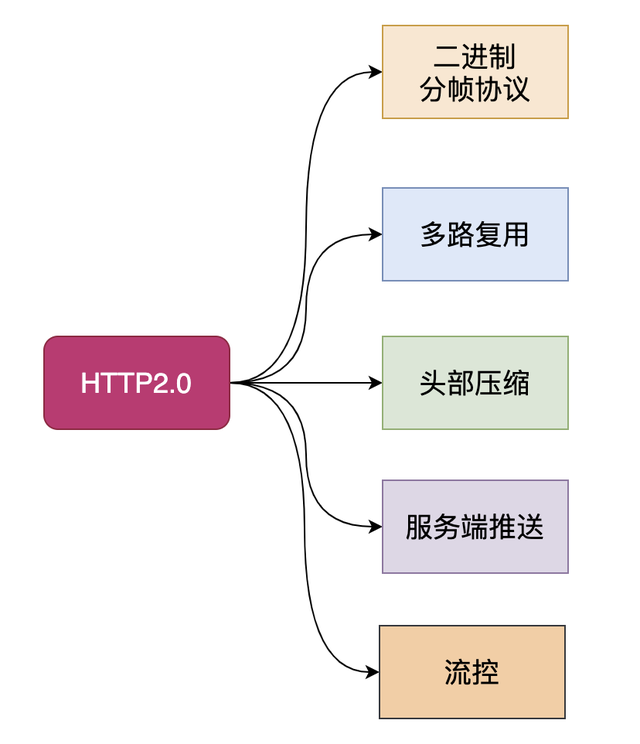
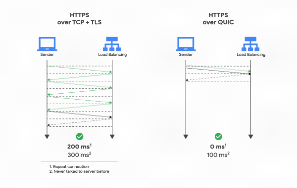

## HTTP2.0

- 多路复用

- 防止队头阻塞
- 压缩HTTP头部
- 服务端推送
- 二进制分帧

## 前言

HTTP2.0大幅度的提高了web性能，在HTTP1.1完全语义兼容的基础上，进一步减少了网络的延迟。实现低延迟高吞吐量。对于前端开发者而言，减少了优化工作。本文将重点围绕以下几点新特性的作用、工作过程以及如何更出色的完成了优化工作来介绍HTTP2.0

- 二进制分帧
- 首部压缩
- 多路复用
- 请求优先级
- 服务器推送

## 一. 介绍

HTTP/2是HTTP协议自1999年HTTP1.1发布后的首个更新，主要基于SPDY协议。

#### 1.1 什么是SPDY协议

SPDY是Speedy的昵音，意为“更快”。它是Google开发的基于TCP协议的应用层协议。目标是优化HTTP协议的性能，通过压缩、多路复用和优先级等技术，缩短网页的加载时间并提高安全性。SPDY协议的核心思想是尽量减少TCP连接数。SPDY并不是一种用于替代HTTP的协议，而是对HTTP协议的增强。

#### 1.2 HTTP1.X的缺点

任何事物的更新都是为了弥补或修复上个版本的某些问题，那么我们来看看HTTP1.x都有哪些缺点以至于我们要使用HTTP2.0。

HTTP1.x有以下几个主要缺点：

1. HTTP/1.0一次只允许在一个TCP连接上发起一个请求，HTTP/1.1使用的流水线技术也只能部分处理请求并发，仍然会存在队列头阻塞问题，因此客户端在需要发起多次请求时，通常会采用建立多连接来减少延迟。
2. 单向请求，只能由客户端发起。
3. 请求报文与响应报文首部信息冗余量大。
4. 数据未压缩，导致数据的传输量大

我们可以通过一个链接来对比一下HTTP2.0到底比HTTP1.x快了多少。[链接地址](https://http2.akamai.com/demo)

## 二. 二进制分帧

在不改变HTTP1.x的语义、方法、状态码、URL以及首部字段的情况下，HTTP2.0是怎样突破HTTP1.1的性能限制，改进传输性能，实现低延迟高吞吐量的呢？关键之一就是在应用层（HTTP）和传输层（TCP）之间增加一个二进制分帧层。

在整理二进制分帧及其作用的时候我们先来铺垫一点关于帧的知识：

- 帧：HTTP2.0通信的最小单位，所有帧都共享一个8字节的首部，其中包含帧的长度、类型、标志、还有一个保留位，并且至少有标识出当前帧所属的流的标识符，帧承载着特定类型的数据，如HTTP首部、负荷、等等。
- 消息：比帧大的通讯单位，是指逻辑上的HTTP消息，比如请求、响应等。由一个或多个帧组成
- 流：比消息大的通讯单位。是TCP连接中的一个虚拟通道，可以承载双向的消息。每个流都有一个唯一的整数标识符

HTTP2.0中所有加强性能的核心是二进制传输，在HTTP1.x中，我们是通过文本的方式传输数据。基于文本的方式传输数据存在很多缺陷，文本的表现形式有多样性，因此要做到健壮性考虑的场景必然有很多，但是二进制则不同，只有0和1的组合，因此选择了二进制传输，实现方便且健壮。
在HTTP2.0中引入了新的编码机制，所有传输的数据都会被分割，并采用二进制格式编码。 

为了保证HTTP不受影响，那就需要在应用层（HTTP2.0）和传输层（TCP or
UDP）之间增加一个二进制分帧层。`在二进制分帧层上，HTTP2.0会将所有传输的信息分为更小的消息和帧，并采用二进制格式编码，其中HTTP1.x的首部信息会被封装到Headers帧，而Request Body则封装到Data帧。`

## 三. 首部压缩

HTTP1.1并不支持HTTP首部压缩，为此SPDY和HTTP2.0出现了。SPDY是用的是DEFLATE算法，而HTTP2.0则使用了专门为首部压缩设计的HPACK算法。

HTTP每次通讯（请求或响应）都会携带首部信息用于描述资源属性。

在HTTP1.0中，我们使用文本的形式传输header，在header中携带cookie的话，每次都需要重复传输几百到几千的字节，这着实是一笔不小的开销。

在HTTP2.0中，我们使用了HPACK（HTTP2头部压缩算法）压缩格式对传输的header进行编码，减少了header的大小。并在两端维护了索引表，用于记录出现过的header，后面在传输过程中就可以传输已经记录过的header的键名，对端收到数据后就可以通过键名找到对应的值。

## 四. 多路复用

在HTTP1.x中，我们经常会使用到雪碧图、使用多个域名等方式来进行优化，都是因为浏览器限制了同一个域名下的请求数量，当页面需要请求很多资源的时候，队头阻塞（Head of line
blocking）会导致在达到最大请求时，资源需要等待其他资源请求完成后才能继续发送。

HTTP2.0中,基于二进制分帧层，HTTP2.0可以在共享TCP连接的基础上同时发送请求和响应。HTTP消息被分解为独立的帧，而不破坏消息本身的语义，交错发出去，在另一端根据流标识符和首部将他们重新组装起来。
通过该技术，可以避免HTTP旧版本的队头阻塞问题，极大提高传输性能。

## 五. 请求优先级

把HTTP消息分为很多独立帧之后，就可以通过优化这些帧的交错和传输顺序进一步优化性能。

## 六. 服务器推送

HTTP2.0新增的一个强大的新功能，就是服务器可以对一个客户端请求发送多个响应。服务器向客户端推送资源无需客户端明确的请求。

服务端根据客户端的请求，提前返回多个响应，推送额外的资源给客户端。如下图，客户端请求stream 1(/page.html)。服务端在返回stream 1的消息的同时推送了stream
2(/script.js)和stream 4(/style.css) 
服务端推送是一种在客户端请求之前发送数据的机制。在HTTP2.0中，服务器可以对一个客户端的请求发送多个响应。如果一个请求是由你的主页发送的，服务器可能会响应主页内容、logo以及样式表，因为他知道客户端会用到这些东西。这样不但减轻了数据传送冗余步骤，也加快了页面响应的速度，提高了用户体验。

推送的缺点：所有推送的资源都必须遵守同源策略。换句话说，服务器不能随便将第三方资源推送给客户端，而必须是经过双方的确认才行。

[摘自](https://blog.csdn.net/yexudengzhidao/article/details/98207149)

## HTTP3.0

把TCP层拆成QUIC + UDP

### HTTP2.0

#### 1.1 HTTP2.0和TCP的爱恨纠葛

HTTP2.0是2015年推出的，还是比较年轻的，其重要的二进制分帧协议、多路复用、头部压缩、服务端推送等重要优化使HTTP协议真正上了一个新台阶。

像谷歌这种重要的公司并没有满足于此，而且想继续提升HTTP的性能，花最少的时间和资源获取极致体验。

那么肯定要问HTTP2.0虽然性能已经不错了，还有什么不足吗？

建立连接时间长(本质上是TCP的问题) 队头阻塞问题 移动互联网领域表现不佳(弱网环境) ......

熟悉HTTP2.0协议的同学应该知道，这些缺点基本都是由于TCP协议引起的，水能载舟亦能覆舟，其实TCP也很无辜呀！

在我们眼里，TCP是面向连接、可靠的传输层协议，当前几乎所有重要的协议和应用都是基于TCP来实现的。

网络环境的改变速度很快，但是TCP协议相对缓慢，正是这种矛盾促使谷歌做出了一个看似出乎意料的决定-基于UDP来开发新一代HTTP协议。

#### 1.2 谷歌为什么选择UDP

上文提到，谷歌选择UDP是看似出乎意料的，仔细想一想其实很有道理。

我们单纯地看看TCP协议的不足和UDP的一些优点：

基于TCP开发的设备和协议非常多，兼容困难 TCP协议栈是Linux内部的重要部分，修改和升级成本很大 UDP本身是无连接的、没有建链和拆链成本 UDP的数据包无队头阻塞问题 UDP改造成本小

从上面的对比可以知道，谷歌要想从TCP上进行改造升级绝非易事，但是UDP虽然没有TCP为了保证可靠连接而引发的问题，但是UDP本身不可靠，又不能直接用。

综合而知，谷歌决定在UDP基础上改造一个具备TCP协议优点的新协议也就顺理成章了，这个新协议就是QUIC协议。

#### 1.3 QUIC协议和HTTP3.0

QUIC其实是Quick UDP Internet Connections的缩写，直译为快速UDP互联网连接。

我们来看看维基百科对于QUIC协议的一些介绍：

QUIC协议最初由Google的Jim Roskind设计，实施并于2012年部署，在2013年随着实验的扩大而公开宣布，并向IETF进行了描述。

QUIC提高了当前正在使用TCP的面向连接的Web应用程序的性能。它在两个端点之间使用用户数据报协议（UDP）建立多个复用连接来实现此目的。

QUIC的次要目标包括减少连接和传输延迟，在每个方向进行带宽估计以避免拥塞。它还将拥塞控制算法移动到用户空间，而不是内核空间，此外使用前向纠错（FEC）进行扩展，以在出现错误时进一步提高性能。

HTTP3.0又称为HTTP Over QUIC，其弃用TCP协议，改为使用基于UDP协议的QUIC协议来实现。

### QUIC协议详解

择其善者而从之，其不善者而改之。

HTTP3.0既然选择了QUIC协议，也就意味着HTTP3.0基本继承了HTTP2.0的强大功能，并且进一步解决了HTTP2.0存在的一些问题，同时必然引入了新的问题。

QUIC协议必须要实现HTTP2.0在TCP协议上的重要功能，同时解决遗留问题，我们来看看QUIC是如何实现的。

#### 2.1 队头阻塞问题

队头阻塞 Head-of-line blocking（缩写为HOL blocking）是计算机网络中是一种性能受限的现象，通俗来说就是：一个数据包影响了一堆数据包，它不来大家都走不了。

队头阻塞问题可能存在于HTTP层和TCP层，在HTTP1.x时两个层次都存在该问题。

HTTP2.0协议的多路复用机制解决了HTTP层的队头阻塞问题，但是在TCP层仍然存在队头阻塞问题。

TCP协议在收到数据包之后，这部分数据可能是乱序到达的，但是TCP必须将所有数据收集排序整合后给上层使用，如果其中某个包丢失了，就必须等待重传，从而出现某个丢包数据阻塞整个连接的数据使用。

QUIC协议是基于UDP协议实现的，在一条链接上可以有多个流，流与流之间是互不影响的，当一个流出现丢包影响范围非常小，从而解决队头阻塞问题。

#### 2.2 0RTT 建链

衡量网络建链的常用指标是RTT Round-Trip Time，也就是数据包一来一回的时间消耗。

RTT包括三部分：往返传播时延、网络设备内排队时延、应用程序数据处理时延。

一般来说HTTPS协议要建立完整链接包括:TCP握手和TLS握手，总计需要至少2-3个RTT，普通的HTTP协议也需要至少1个RTT才可以完成握手。

然而，QUIC协议可以实现在第一个包就可以包含有效的应用数据，从而实现0RTT，但这也是有条件的。

简单来说，基于TCP协议和TLS协议的HTTP2.0在真正发送数据包之前需要花费一些时间来完成握手和加密协商，完成之后才可以真正传输业务数据。

但是QUIC则第一个数据包就可以发业务数据，从而在连接延时有很大优势，可以节约数百毫秒的时间。

QUIC的0RTT也是需要条件的，对于第一次交互的客户端和服务端0RTT也是做不到的，毕竟双方完全陌生。

因此，QUIC协议可以分为首次连接和非首次连接，两种情况进行讨论。

#### 2.3 首次连接和非首次连接

使用QUIC协议的客户端和服务端要使用1RTT进行密钥交换，使用的交换算法是DH(Diffie-Hellman)迪菲-赫尔曼算法。

DH算法开辟了密钥交换的新思路，在之前的文章中提到的RSA算法也是基于这种思想实现的，但是DH算法和RSA的密钥交换不完全一样，感兴趣的读者可以看看DH算法的数学原理。

DH算法开辟了密钥交换的新思路，在之前的文章中提到的RSA算法也是基于这种思想实现的，但是DH算法和RSA的密钥交换不完全一样，感兴趣的读者可以看看DH算法的数学原理。

##### 2.3.1 首次连接

简单来说一下，首次连接时客户端和服务端的密钥协商和数据传输过程，其中涉及了DH算法的基本过程：

1. 客户端对于首次连接的服务端先发送client hello请求。
2. 服务端生成一个素数p和一个整数g，同时生成一个随机数 (笔误-此处应该是Ks_pri)为私钥，然后计算出公钥 = mod p，服务端将，p，g三个元素打包称为config，后续发送给客户端。
3. 客户端随机生成一个自己的私钥，再从config中读取g和p，计算客户端公钥 = mod p。
4. 客户端使用自己的私钥和服务端发来的config中读取的服务端公钥，生成后续数据加密用的密钥K = mod p。
5. 客户端使用密钥K加密业务数据，并追加自己的公钥，都传递给服务端。
6. 服务端根据自己的私钥和客户端公钥生成客户端加密用的密钥K = mod p。
7. 为了保证数据安全，上述生成的密钥K只会生成使用1次，后续服务端会按照相同的规则生成一套全新的公钥和私钥，并使用这组公私钥生成新的密钥M。
8. 服务端将新公钥和新密钥M加密的数据发给客户端，客户端根据新的服务端公钥和自己原来的私钥计算出本次的密钥M，进行解密。
9. 之后的客户端和服务端数据交互都使用密钥M来完成，密钥K只使用1次。

##### 2.3.2 非首次连接

前面提到客户端和服务端首次连接时服务端传递了config包，里面包含了服务端公钥和两个随机数，客户端会将config存储下来，后续再连接时可以直接使用，从而跳过这个1RTT，实现0RTT的业务数据交互。

客户端保存config是有时间期限的，在config失效之后仍然需要进行首次连接时的密钥交换。

#### 2.4 前向安全问题

前向安全是密码学领域的专业术语，看下百度上的解释：

前向安全或前向保密Forward Secrecy是密码学中通讯协议的安全属性，指的是长期使用的主密钥泄漏不会导致过去的会话密钥泄漏。

前向安全能够保护过去进行的通讯不受密码或密钥在未来暴露的威胁，如果系统具有前向安全性，就可以保证在主密钥泄露时历史通讯的安全，即使系统遭到主动攻击也是如此。

通俗来说，前向安全指的是密钥泄漏也不会让之前加密的数据被泄漏，影响的只有当前，对之前的数据无影响。

前面提到QUIC协议首次连接时先后生成了两个加密密钥，由于config被客户端存储了，如果期间服务端私钥泄漏，那么可以根据K = mod p计算出密钥K。

如果一直使用这个密钥进行加解密，那么就可以用K解密所有历史消息，因此后续又生成了新密钥，使用其进行加解密，当时完成交互时则销毁，从而实现了前向安全。

#### 2.5 前向纠错

前向纠错是通信领域的术语，看下百科的解释：

前向纠错也叫前向纠错码Forward Error Correction 简称FEC 是增加数据通讯可信度的方法，在单向通讯信道中，一旦错误被发现，其接收器将无权再请求传输。

FEC 是利用数据进行传输冗余信息的方法，当传输中出现错误，将允许接收器再建数据。

听这段描述就是做校验的，看看QUIC协议是如何实现的：

QUIC每发送一组数据就对这组数据进行异或运算，并将结果作为一个FEC包发送出去，接收方收到这一组数据后根据数据包和FEC包即可进行校验和纠错。

#### 2.6 连接迁移

网络切换几乎无时无刻不在发生。

TCP协议使用五元组来表示一条唯一的连接，当我们从4G环境切换到wifi环境时，手机的IP地址就会发生变化，这时必须创建新的TCP连接才能继续传输数据。

QUIC协议基于UDP实现摒弃了五元组的概念，使用64位的随机数作为连接的ID，并使用该ID表示连接。

基于QUIC协议之下，我们在日常wifi和4G切换时，或者不同基站之间切换都不会重连，从而提高业务层的体验。

### QUIC的应用和前景

通过前面的一些介绍我们看出来QUIC协议虽然是基于UDP来实现的，但是它将TCP的重要功能都进行了实现和优化，否则使用者是不会买账的。

QUIC协议的核心思想是将TCP协议在内核实现的诸如可靠传输、流量控制、拥塞控制等功能转移到用户态来实现，同时在加密传输方向的尝试也推动了TLS1.3的发展。

但是TCP协议的势力过于强大，很多网络设备甚至对于UDP数据包做了很多不友好的策略，进行拦截从而导致成功连接率下降。

主导者谷歌在自家产品做了很多尝试，国内腾讯公司也做了很多关于QUIC协议的尝试。

其中腾讯云对QUIC协议表现了很大的兴趣，并做了一些优化然后在一些重点产品中对连接迁移、QUIC成功率、弱网环境耗时等进行了实验，给出了来自生产环境的诸多宝贵数据。

简单看一组腾讯云在移动互联网场景下的不同丢包率下的请求耗时分布：

任何新生事物的推动都是需要时间的，出现多年的HTTP2.0和HTTPS协议的普及度都没有预想高，IPv6也是如此，不过QUIC已经展现了强大的生命力，让我们拭目以待吧！

[摘自](https://baijiahao.baidu.com/s?id=1677802258258817086&wfr=spider&for=pc)
