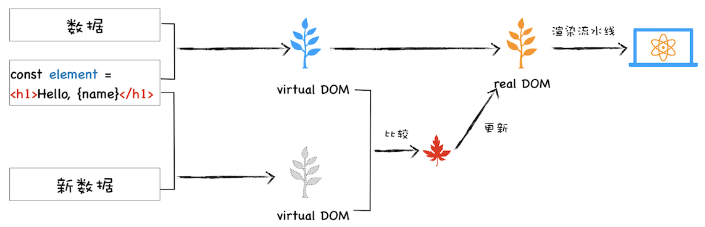

# 虚拟DOM

## 虚拟DOM是什么

[首先了解一下DOM是什么](https://www.runoob.com/htmldom/htmldom-tutorial.html):

> DOM (Document Object Model) 译为文档对象模型，是 HTML 和 XML 文档的编程接口。\
> HTML DOM 定义了访问和操作 HTML 文档的标准方法。\
> DOM 以树结构表达 HTML 文档。

然后我们来做一个小实验：

```js
const div = document.createElement('div');
let str = '';
for(let i in div) {
  str += `${i} `
}
const attrs = str.split(' ')
console.log(attrs.splice(0,5), attrs.length)
```

out

```js
(5) ["align", "title", "lang", "translate", "dir"] 294
```

我们可以看到浏览器对 `DOM` 赋予了很多属性来实现页面的各种功能，整个 `DOM` 的设计是相当复杂的。

当我们使用 `document.body.appendChild(node)` 往 `body` 节点上添加一个元素，调用该 `API` 之后会引发一系列的连锁反应。\
首先渲染引擎会将 `node` 节点添加到 `body` 节点之上，然后触发样式计算、布局、绘制、栅格化、合成等任务，我们把这一过程称为重排。\
除了重排之外，还有可能引起重绘或者合成操作，形象地理解就是“牵一发而动全身”。\
另外，对于 `DOM` 的不当操作还有可能引发强制同步布局和布局抖动的问题，这些操作都会大大降低渲染效率。\
因此，对于 `DOM` 的操作我们时刻都需要非常小心谨慎。

当然，对于简单的页面来说，其 `DOM` 结构还是比较简单的，所以以上这些操作 `DOM` 的问题并不会对用户体验产生太多影响。\
但是对于一些复杂的页面或者目前使用非常多的单页应用来说，其 `DOM` 结构是非常复杂的，而且还需要不断地去修改 `DOM` 树，每次操作 `DOM` 渲染
引擎都需要进行重排、重绘或者合成等操作，因为 `DOM` 结构复杂，所生成的页面结构也会很复杂，对于这些复杂的页面，执行一次重排或者重绘操作 都是非常耗时的，这就给我们带来了真正的性能问题。

所以我们需要有一种方式来减少 JavaScript 对 `DOM` 的操作，这时候虚拟 `DOM` 就上场了。

简而言之，我们需要用一种方式去描述浏览器的 `DOM` 结构，并且在数据更新的过程中通过虚拟 `DOM` 的对比来做一层“缓冲”。避免频繁的直接操作 `DOM` 对象。

## 什么是虚拟`DOM`

在谈论什么是虚拟 `DOM` 之前，我们先来看看虚拟 `DOM` 到底要解决哪些事情。

- 将页面改变的内容应用到虚拟 `DOM` 上，而不是直接应用到 `DOM` 上。
- 变化被应用到虚拟 `DOM` 上时，虚拟 `DOM` 并不急着去渲染页面，而仅仅是调整虚拟 `DOM` 的内部状态，这样操作虚拟 `DOM` 的代价就变得非常轻了。
- 在虚拟 `DOM` 收集到足够的改变时，再把这些变化一次性应用到真实的 `DOM` 上。

基于以上三点，我们再来看看什么是虚拟 DOM。为了直观理解，你可以参考下图：



该图结合 React 流程画的一张虚拟 `DOM` 执行流程图，下面我们就结合这张图来分析下虚拟 `DOM` 到底怎么运行的。

创建阶段。首先依据 JSX 和基础数据创建出来虚拟 DOM，它反映了真实的 `DOM` 树的结构。然后由虚拟 `DOM` 树创建出真实 `DOM` 树，真实的 `DOM` 树生成完后，
再触发渲染流水线往屏幕输出页面。

更新阶段。如果数据发生了改变，那么就需要根据新的数据创建一个新的虚拟 `DOM` 树；然后 React 比较两个树，找出变化的地方，并把变化的地方一次性更新到真实的 `DOM` 树上

最后渲染引擎更新渲染流水线，并生成新的页面。

通过上面的描述，我们知道，当我们使用一个JS对象来描述浏览器的 `DOM` 结构的时候，这个对象就叫做虚拟 `DOM`。（浏览器的 `DOM` 对象过于复杂）

下面这段话是我摘录的一段对于虚拟 `DOM`的描述。

> 1. `Virtual DOM` 是一种编程概念。在这个概念里， `UI` 以一种理想化的，或者说“虚拟的”表现形式被保存于内存中，并通过如 `ReactDOM` 等类库使之与“真实的”
   > `DOM` 同步。这一过程叫做协调。
> 2. 这种方式赋予了 `React` 声明式的 `API`：你告诉 `React` 希望让 `UI` 是什么状态，`React` 就确保 `DOM` 匹配该状态。这使您可以从属性操作、
   > 事件处理和手动 `DOM` 更新这些在构建应用程序时必要的操作中解放出来。
> 3. 与其将 `Virtual DOM` 视为一种技术，不如说它是一种模式，人们提到它时经常是要表达不同的东西。在 `React` 的世界里，术语 `Virtual DOM` 通常 与
   > `React` 元素关联在一起，因为它们都是代表了用户界面的对象。
> 4. 而 `React` 也使用一个名为 `fibers` 的内部对象来存放组件树的附加信息。上述二者也被认为是 `React` 中 `Virtual DOM` 实现的一部分。

我们来总结一下上面的话中比较重要的两点：

1. 虚拟 `DOM` 和真实 `DOM` 的交互不由虚拟 `DOM` 直接完成，交由第三方库完成，虚拟 `DOM` 只描述 `UI`，`UI` 到具体的展现，由 `ReactDOM`
   等类库实现真正的渲染。 因此，`ReactNative`，小程序等跨端开发才得以实现。
2. `React` 之类的类库，替你摆脱了频繁书写 `DOM` 操作的指令的坑，你不必再去书写类似 `document.getElementById(xxx).appendChild(xxx)`
   之类的代码。 他们来负责数据变动到视图变动的过程。

在 `React` 或者 `Vue` 中，虚拟 `DOM` 的创建都是由模板或者 `JSX` 来完成的，但是这两者到虚拟 `DOM` 的转移都是工程化干的事情（`webpack` +
`loader`），因此我们也不需要去书写类似 `React.createElement(xxx)` 的代码，只需要书写 `JSX` 即可以通过工程化自动生成上面的代码。

因此虚拟 `DOM` 极大程度上帮我们减轻了开发的负担，易于维护，并且不依赖于某一特定的环境。

## VDOM的优点

- 抽象了原本的渲染过程，实现了跨平台的的能力，从而不局限于浏览器的 `DOM`，也可以是安卓和 `IOS` 的原生组件，也可以是小程序。
- 抽象了渲染过程之后，使得组件的抽象能力也得到了提升，并且可以适配 `DOM` 以外的渲染目标。
- `VDOM` 在牺牲了部分性能的前提下，增加了可维护性，这也是很多框架的通性。 实现了对 `DOM` 集中化操作，在数据改变的时候先对 `VDOM`
  进行修改，再反映到真实的DOM中，用最小的代价来更新 `DOM` ，提升效率。

- 打开了函数式 `UI` 编程的大门
- 跨平台（ `ReactNative` ，`React VR` 等）
- 可以更好的实现 `SSR`，同构渲染等
- 组件的高度抽象化

## VDOM的缺点

- 首次渲染大量 `DOM` 的时候，由于多了一层虚拟 `DOM` 的计算，所以会比 `innerHTML` 插入的慢。
- 需要在内存中维护一份 `VDOM`
- 如果虚拟 `DOM` 有着大量的更改，使用虚拟 `DOM` 是很合适的，如果是单一的频繁的更新的话，虚拟 `DOM` 需要花时间去处理计算工作。\
  因此如果你有一个 `DOM` 节点相对较少的页面，使用 `VDOM` 可能会变慢。\
  但是对于大多数单页面应用，使用 `VDOM` 应该是更快的

## React 中的 diff 算法

[React的虚拟DOM与diff算法的理解](https://blog.csdn.net/qq_36407875/article/details/84965311)

[React源码分析 - Diff算法](https://zhuanlan.zhihu.com/p/34363711)

## 关于React中的虚拟DOM

[React中的虚拟DOM](https://zhuanlan.zhihu.com/p/50218605)

> `Fiber` 架构之后的不同。可以自行搜索 `Fiber` 相关的内容。\
> `Fiber` 之后，虚拟 `DOM` 从树形结构变为了可恢复的链表的结构。

`Fiber` 的出现主要是为了解决在大量 `dom diff` 的过程中，保证渲染流畅，（原来的 `stack reconciler` 会在 `diff`
过程中阻塞线程，导致页面卡顿，因为只有`diff` 完成之后才会渲染页面）\
其实协程的另外一个称呼就是 `Fiber`，所以在这里我们可以把 `Fiber` 和协程关联起来，那么所谓的 `Fiber reconciler` 相信你也很清楚了，就是在执行算法的过程中出让主线程

这样就解决了 `Stack reconciler` 函数占用时间过久的问题。\
实际上的思想类似于时间切片的概念。\
主要利用了浏览器 `requestIdleCallback` 这个 `API`

## 关于Vue中的虚拟DOM

整体的实现思路大致类似上面的手动实现的方法。

以 `Vue2.x` 为例，可以在源码中找到[这个文件](https://github.com/vuejs/vue/blob/dev/src/core/vdom/patch.js)来看一下。

在 `Vue3.x` 中并没有引进 `Fiber` 这一架构，具体原因可以在拓展阅读中查看。

## 拓展阅读

1. [如何实现一个简单的虚拟dom](https://blog.csdn.net/qq_29582173/article/details/103078900)
2. [尤大Vue3.0直播虚拟Dom总结(和React 对比)](https://zhuanlan.zhihu.com/p/135214155)
